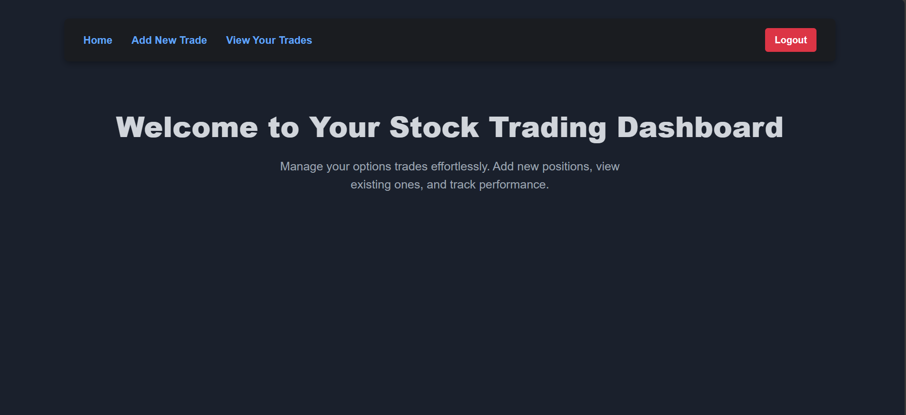
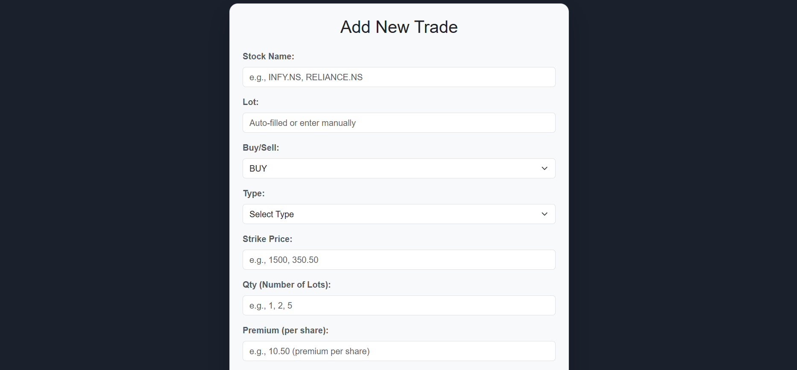
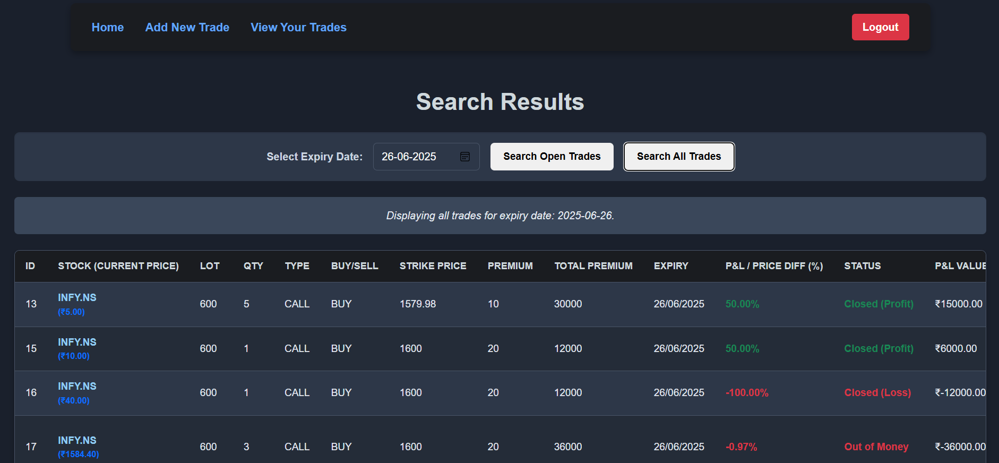
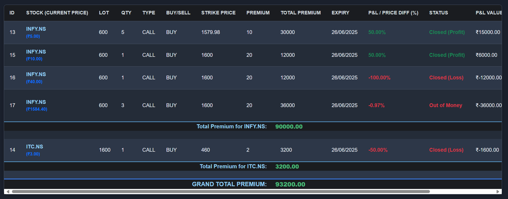

#  QuantDash

**QuantDash** is a full-stack web application that helps users manage and monitor their stock option trades. It allows users to log trades, track real-time stock prices via the Yahoo Finance API, and view metrics like total premium and profit/loss.

---

##  Features

- Add trades with:
  - Stock name
  - Strike price
  - Option type (Call/Put)
  - Premium
  - Lot size
  - Quantity
  - Expiry date
- Automatically calculates:
  -  Total Premium = Lot × Quantity × Premium
  -  Current Value (based on live stock price)
  -  Profit or Loss at close
- View trades filtered by expiry
- Edit or delete trades
- Displays summary of trades including:
  - Total Premium Invested
  - Current Value
  - Net Profit/Loss
- Responsive and user-friendly UI

---

##  Screenshots

### Home Page  
*Welcome screen introducing the dashboard.*  


### Add Trade Page  
*Form to enter stock trade details.*  


### View Trades Page  
*Detailed trade list with filters and actions.*  


### Trade Table  
*Live trades with calculated metrics.*  


---

##  Tech Stack

### 🔹 Frontend
- React
- Axios
- React Router DOM
- CSS / Bootstrap

### 🔹 Backend
- Node.js
- Express.js
- MySQL
- Yahoo Finance API (`yahoo-finance2`)
- CORS, dotenv

---

##  Setup Instructions

This guide helps you set up the project locally.

###  Prerequisites

- Node.js and npm
- MySQL
- Git

---

###  1. Clone the Repository

```bash
git clone https://github.com/jacobalex-19/stock-tracker.git
cd stock-tracker
```

---

###  2. Backend Setup

```bash
cd backend
npm install
```

Create a `.env` file inside the `backend/` folder and add your MySQL credentials:

```env
DB_HOST=localhost
DB_USER=your_mysql_user
DB_PASSWORD=your_mysql_password
DB_NAME=stock_tracker
```

Make sure the database and required table exist in MySQL. Then start the backend server:

```bash
node server.js
```

The backend runs at: `http://localhost:5000`

---

###  3. Frontend Setup

```bash
cd ../frontend
npm install
npm start
```

The frontend will be live at: `http://localhost:3000`

---

##  Environment Variables

You will need to configure the following in your `.env` file:

```env
DB_HOST=localhost
DB_USER=root
DB_PASSWORD=your_password
DB_NAME=stock_tracker
```

---

##  License

This project is licensed under the [MIT License](https://opensource.org/licenses/MIT). You are free to use, modify, and distribute this project with attribution.

---

##  Author

**Jacob Eluvathingal**  
[LinkedIn](https://www.linkedin.com/in/jacob-eluvathingal-a062a6293/) • [GitHub](https://github.com/jacobalex-19)
